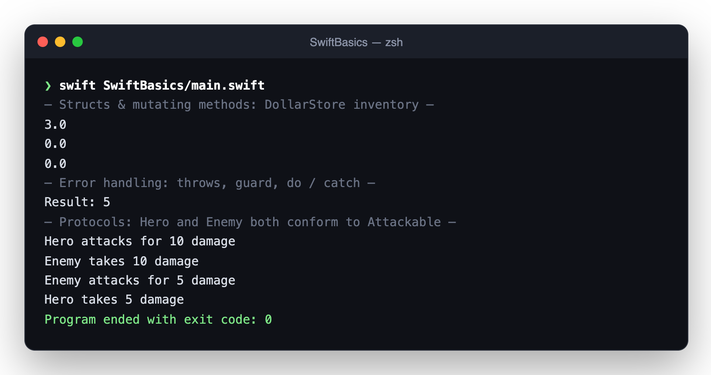

<div align="center">

# SwiftBasics

**A hands-on tour of the Swift language in one runnable file, from `var` to protocols.**




</div>

---

## What's inside

SwiftBasics is the scratchpad I used to learn Swift's core building blocks before moving on to SwiftUI apps. Each concept is a small, self-contained example with its expected output alongside, so it doubles as a quick-reference cheat sheet.

| Topic | Example |
|---|---|
| **Variables, constants and tuples** | `var` vs `let`, type annotations, tuple destructuring |
| **Conditionals and logic** | `if/else` with `&&` / `\|\|` (premium access, discounts, weather) |
| **Loops and `switch`** | `for-in`, `while`, pattern-matching `switch` |
| **Functions** | Parameters, argument labels and return values |
| **Structs and mutating methods** | `DollarStore`: an inventory that updates as you buy |
| **Enums and error handling** | `throws`, `guard`, and typed `do / catch` for division errors |
| **Protocols** | `Attackable` with `Hero` and `Enemy` trading blows |

The current build runs the structs, error-handling and protocol sections, shown above. The earlier exercises are kept in the file, commented out, so you can toggle any section back on.

## Run it

```sh
# Xcode
open SwiftBasics.xcodeproj    # then press ⌘R

# or straight from the terminal
swift SwiftBasics/main.swift
```

## About

Written by **Roszhan Raj** for CPSC 411 (iOS Development) at California State University, Fullerton.
